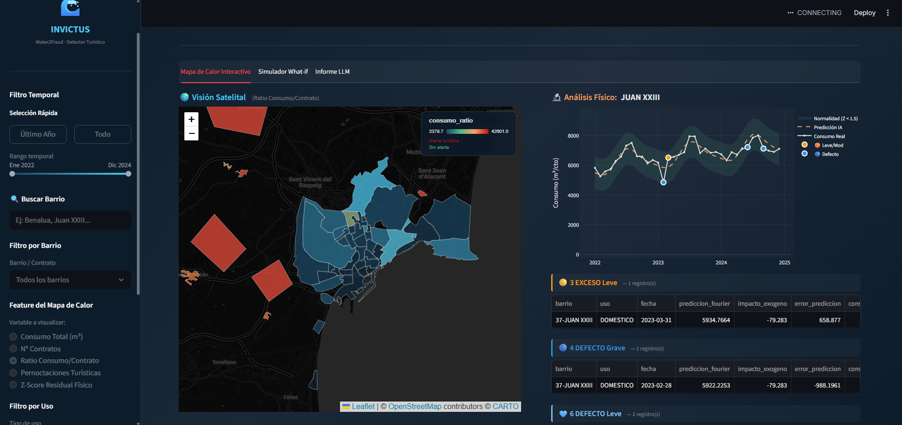
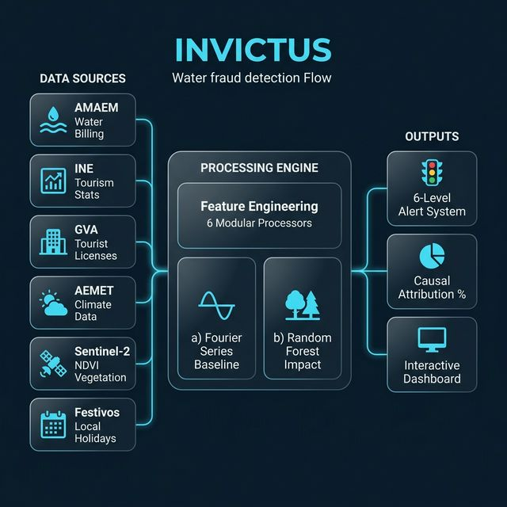
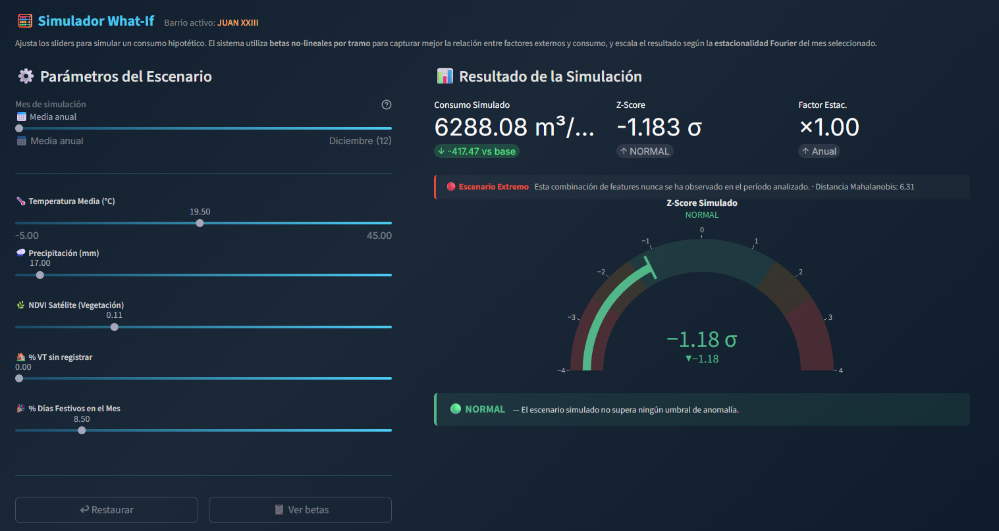

<div align="center">

# 🌊 INVICTUS

### *Water2Fraud — Detección Inteligente de Viviendas Turísticas Ilegales*

[](https://python.org)
[](https://streamlit.io)
[](https://scipy.org)
[](https://scikit-learn.org)
[](#)
[](#)

<br>

> **¿Y si pudiéramos detectar pisos turísticos ilegales solo analizando el agua que consumen?**
>
> INVICTUS cruza datos de facturación hídrica con clima, vegetación satelital, turismo oficial y calendario festivo para revelar patrones de consumo anómalos — la huella invisible del alquiler turístico clandestino.

<br>



<sub>Dashboard interactivo: Mapa choropleth de Alicante · Series temporales con detección de anomalías · Atribución causal automática</sub>

</div>

---

## ⚡ Inicio Rápido

```bash
# 1. Clonar e instalar
git clone https://github.com/santvz6/Invictus.git
cd Invictus
python -m venv venv && source venv/bin/activate
pip install -r requirements.txt

# 2. Ejecutar el pipeline de detección
python main.py --run

# 3. Lanzar el dashboard
./venv/bin/streamlit run dashboard/app.py
```

> [!NOTE]
> El informe LLM requiere [Ollama](https://ollama.com/) con el modelo `qwen3`:
> ```bash
> curl -fsSL https://ollama.com/install.sh | sh
> ollama run qwen3
> ```

---

## 🧠 ¿Cómo funciona?

INVICTUS utiliza un **modelo híbrido de física + machine learning** para determinar cuánta agua *debería* consumir cada barrio de Alicante, y detectar desviaciones sospechosas que podrían indicar actividad turística no declarada.

<div align="center">

</div>

### El Modelo en 3 Frases

1. **Base Física (Fourier):** Ajustamos una onda estacional de 2° orden por cada combinación `[Barrio × Uso]` para capturar el patrón natural de consumo — la "huella dactilar hídrica" de cada zona.

2. **Impacto Exógeno (Random Forest):** El residuo entre lo que Fourier predice y el consumo real se modela con un RF que aprende el impacto de temperatura, lluvia, vegetación, turismo y festivos.

3. **Detección y Triaje:** La diferencia final (`consumo_real - consumo_esperado`) se convierte en un Z-Score que alimenta un **semáforo de 6 niveles** + atribución causal porcentual automática.

<br>

<details>
<summary><b>📐 Formulación Matemática</b></summary>

<br>

**Modelo de Fourier (2° orden con tendencia):**

$$C_{base}(t) = mt + c + a_1\cos(\omega t) + b_1\sin(\omega t) + a_2\cos(2\omega t) + b_2\sin(2\omega t) \quad \text{donde } \omega = \frac{2\pi}{12}$$

**Consumo Físico Esperado:**

$$\hat{C}(t) = C_{base}(t) + \text{RF}(x_{clima}, x_{ndvi}, x_{turismo}, x_{festivos})$$

**Z-Score de Anomalía (por grupo \[Barrio × Uso\]):**

$$Z = \frac{C_{real}(t) - \hat{C}(t)}{\sigma_{grupo}}$$

**Umbrales del Semáforo:**

| Nivel | Z-Score | Significado |
|-------|---------|-------------|
| 🔴 `EXCESO_Grave` | Z > 2.5 | Consumo extremadamente elevado |
| 🟠 `EXCESO_Moderado` | 2.0 < Z ≤ 2.5 | Consumo significativamente elevado |
| 🟡 `EXCESO_Leve` | 1.5 < Z ≤ 2.0 | Consumo ligeramente elevado |
| 🟡 `DEFECTO_Leve` | -2.0 ≤ Z < -1.5 | Consumo ligeramente bajo |
| 🟠 `DEFECTO_Moderado` | -2.5 ≤ Z < -2.0 | Consumo significativamente bajo |
| 🔴 `DEFECTO_Grave` | Z < -2.5 | Consumo extremadamente bajo |

</details>

---

## 🗂️ Fuentes de Datos

INVICTUS integra **6 fuentes de datos públicas** cruzadas geo-temporalmente a nivel de barrio y mes (2022–2024):

| Fuente | Organismo | Variables Clave | Resolución |
|--------|-----------|-----------------|------------|
| 💧 **AMAEM** | Aguas de Alicante | Consumo (L), Nº contratos, Uso | Barrio × Mes |
| 📊 **INE** | Inst. Nacional Estadística | Viviendas turísticas, Ocupación, Pernoctaciones | Municipio → Barrio |
| 🏛️ **GVA** | Generalitat Valenciana | Registro oficial VT y hoteles | Municipio × Mes |
| ☀️ **AEMET** | Agencia Meteorología | Temperatura media, Precipitación | Barrio × Mes |
| 🛰️ **Sentinel-2** | Copernicus / ESA | NDVI (índice de vegetación) | Barrio × Mes |
| 📅 **Festivos** | Ayto. Alicante | Días festivos, % festivos/mes | Barrio × Mes |

> [!IMPORTANT]
> La detección del **"Gap de Ilegalidad"** se calcula como la diferencia entre las viviendas turísticas estimadas por el INE y las oficialmente registradas en la GVA, distribuida proporcionalmente por barrio.

---

## 🏗️ Arquitectura del Proyecto

```
Invictus/
├── main.py                     # 🚀 Orquestador del pipeline
├── src/
│   ├── config/
│   │   ├── features.py         # Ground Truth: variables + escalado
│   │   ├── string_keys.py      # Diccionario centralizado de columnas
│   │   ├── paths.py            # Rutas del proyecto (pathlib)
│   │   ├── ai_constants.py     # Parámetros ML y LLM
│   │   └── barrio_mapping.py   # Mapeo INE → Barrios AMAEM
│   ├── features/
│   │   ├── preprocessor.py     # 🧩 Orquestador de 6 procesadores
│   │   ├── amaem_processor.py  # Ingesta agua (AMAEM)
│   │   ├── ine_tourism_processor.py  # Turismo municipal (INE)
│   │   ├── gva_processor.py    # Registro oficial VT (GVA)
│   │   ├── aemet_processor.py  # Clima (AEMET)
│   │   ├── sentinel_processor.py     # NDVI satelital (Sentinel-2)
│   │   └── holiday_barrio_processor.py  # Festivos locales
│   └── model.py                # 🔬 Motor Fourier + Random Forest
├── dashboard/
│   ├── app.py                  # 🌐 Dashboard Streamlit principal
│   ├── data_loader.py          # Carga y agregación de datos
│   └── components/
│       ├── map_view.py         # 🗺️ Mapa choropleth (Folium)
│       ├── whatif_simulator.py # 🎛️ Simulador What-If
│       └── llm_report.py       # 🤖 Informe LLM (Ollama/Qwen3)
├── notebooks/                  # Análisis exploratorio
├── internal/                   # Datos, experimentos, logs
└── requirements.txt
```

---

## 📊 Dashboard Interactivo

El dashboard está construido con **Streamlit** y ofrece tres módulos principales:

### 🗺️ Tab 1 — Mapa de Calor + Panel de Análisis Físico

Visualización choropleth interactiva de Alicante con geometrías reales (GeoJSON). Al hacer clic en cualquier barrio se despliega:

- **Serie temporal** del consumo real vs. estimado físico
- **Marcadores de anomalía** sobre los puntos que exceden los umbrales de Z-Score
- **Gráfico de atribución causal** (donut) que desglosa el % de cada factor exógeno en las alertas

### 🎛️ Tab 2 — Simulador What-If

<div align="center">

</div>

Permite ajustar manualmente los valores de las 5 variables exógenas y visualizar en tiempo real:

| Variable | Rango | Descripción |
|----------|-------|-------------|
| 🌡️ Temperatura | -5 a 45 °C | Media mensual del barrio |
| 🌧️ Precipitación | 0 a 300 mm | Acumulada mensual |
| 🌿 NDVI | -1 a 1 | Índice de vegetación satelital |
| 🏠 % VT sin registrar | 0 a 100% | Estimación de turismo ilegal |
| 🎉 % Festivos | 0 a 50% | Proporción de días festivos |

**Salidas del simulador:**
- **Gauge** del Z-Score simulado con semáforo de alerta
- **Barras comparativas** (Base Fourier vs Simulación vs Real Histórico)
- **Radar de sensibilidad** mostrando la contribución de cada feature

### 🤖 Tab 3 — Informe LLM

Genera un análisis cualitativo del barrio seleccionado utilizando **Qwen3** vía Ollama, alimentado con las métricas reales del modelo físico como contexto.

---

## 🔬 Pipeline de Procesamiento

El pipeline se ejecuta con un solo comando y procesa los datos en 5 fases secuenciales:


Cada fase genera un **checkpoint CSV** intermedio en `internal/processed/` para trazabilidad y auditoría.

---

## 🛡️ Prevención de Data Leakage

> [!CAUTION]
> Para garantizar la validez científica de los resultados, INVICTUS implementa una estricta separación temporal:

- **Fourier** se ajusta **solo con datos 2022–2023** y predice sobre 2024
- **Random Forest** se entrena **solo con datos 2022–2023** y predice sobre todo el histórico
- Las anomalías detectadas en 2024 son **predicciones genuinas**, no ajustes retrospectivos

---

## 📚 Fuentes y Referencias

Para una consulta técnica detallada y descarga de citaciones en formato BibTeX, consulta el archivo [references.bib](./references.bib).

---

<div align="center">

### Hecho con 💧 por el equipo INVICTUS

*Hackathon 2026 · Alicante, España*

</div>
